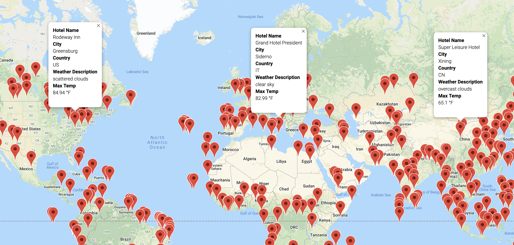
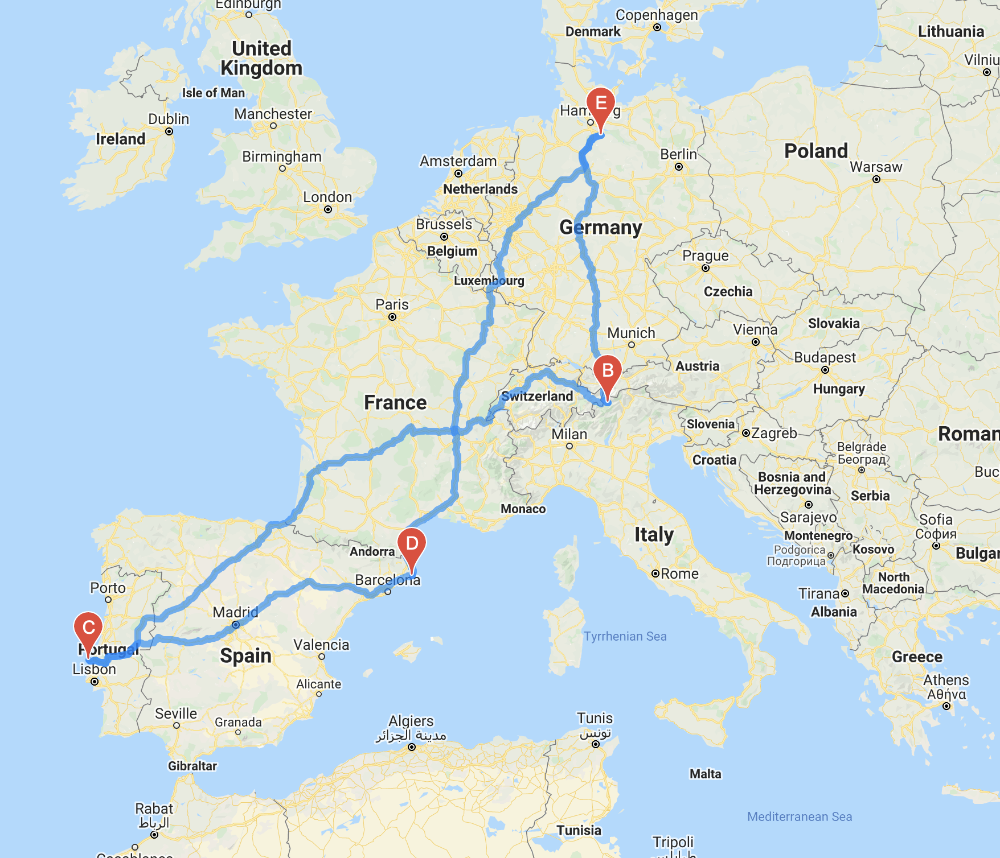
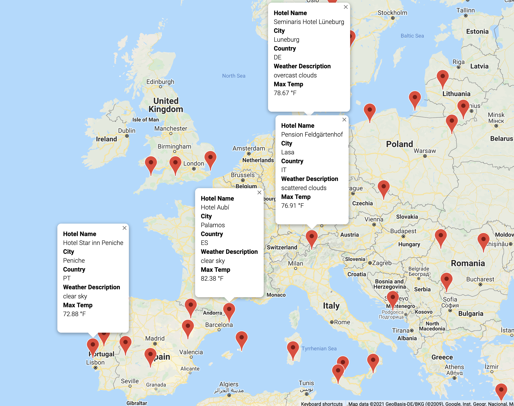

# World Weather Analysis

## Overview

This analysis looks at different weather patterns around the globe and offers insights to travelers who want to book a trip. There are three folders here that offer different levels of analysis: weather database, vacation search, and vacation itinerary.

### Weather Database

This folder uses Open Weather Map API to pull weather information on over 600 different cities around the world. That information consists of:

1. Maximum Temperature
2. Cloudiness
3. Wind Speed
4. Humidity
5. Current Weather Description

These different categories of information make it easy for travelers to choose exactly what they are looking for in a travel destination.

### Vacation Search

This folder takes the information from the weather database and uses Google Maps API to plot different travel destinations with a hotel at each location. For example, the image below shows the locations of all the places in the database that have an daily maximum temperature between 65 and 85 degrees farinheit.

### Vacation Itinerary

This folder takes the search information from the search folder and uses Google Maps directions API to create a vacation itinerary. For example, the image below shows a 4 stop itinerary in Northern California that features Ukiah, Carson City, Laguna, and Half Moon Bay.

Also, as with the vacation search folder, there is a hotel at each location.

